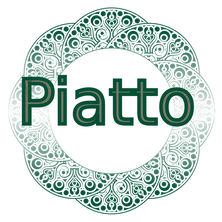

# Piatto — AI-Powered Recipe & Cooking Assistant



> **From Chaos to Culinary Excellence**  
> Built for the **Google Cloud Run Hackathon 2025**

**[Live Demo](https://piatto-cooks.com)** | **[Documentation](#documentation)** | **[Architecture](#architecture)**

   
## 🥘 Overview

Cooking can be chaotic — from figuring out what to make to juggling timers and ingredients. **Piatto** is your **AI-powered culinary assistant**, transforming that chaos into creativity.

With Piatto, you can:
- 🍅 **Generate personalized recipes** from your available ingredients  
- 🥄 **Get real-time, step-by-step cooking guidance**  
- 🗣️ **Ask contextual cooking questions** (hands-free with voice)  
- ⏱️ **Automate timers and measurements**, all in one interface  

Built for the **Google Cloud Run Hackathon**, Piatto demonstrates:
- Scalable **serverless architecture**  
- **Multi-agent AI orchestration** with **Google ADK**  
- **Global edge delivery** for lightning-fast performance  

---
   

## Features

### 🧩 Core Functionality

- **AI Recipe Generation** — Create recipes from ingredients (text or image input)  
- **Image Analysis** — Upload photos; let AI identify ingredients & suggest dishes  
- **Interactive Cooking Chat** — Get substitutions, troubleshoot mistakes, and more  
- **Step-by-Step Instructions** — Context-aware cooking with automated timers  
- **Recipe Library** — Save, organize, and share your favorites  
- **Multilingual Support** — i18next-powered (English & German)  
- **Voice Assistant** — Hands-free cooking with optional voice commands  

### ⚙️ Technical Highlights

- **Serverless Auto-Scaling** with Google Cloud Run  
- **Multi-Agent AI** powered by **Google ADK**  
- **Global Edge Delivery** via Cloud CDN (150+ PoPs)  
- **Secure & Scalable**: VPC, Cloud SQL, OAuth 2.0, managed SSL  
- **Automated CI/CD** with GitHub Actions & Artifact Registry  

---

## 🧱 Tech Stack

### 🖥️ Frontend

- **React 19** (Hooks & Functional Components)  
- **Vite 7** for ultra-fast builds  
- **Tailwind CSS 4** + custom theme tokens  
- **React Router 6** (protected routes)  
- **i18next** for localization  
- **Axios** (cookie-based auth)  
- **Framer Motion** & **Lottie** for animations  

### ⚡ Backend

- **FastAPI** with `async/await`  
- **Uvicorn** ASGI server  
- **SQLAlchemy 2.0** async ORM (`aiomysql` + SQLite fallback)  
- **Pydantic v2**, **Authlib**, **JWT**, **bcrypt**  
- **APScheduler** for background tasks  

### 🤖 AI & Agents

- **Google ADK v1.16.0** with **Gemini 2.5 Flash** foundation model  
- **Multi-Agent Architecture**:
  - 🖼️ *Image Analyzer* — Ingredient recognition  
  - 🍽️ *Recipe Agent* — Personalized recipe generation  
  - 📋 *Instruction Agent* — Step-by-step cooking guide  
  - 🎨 *Image Agent* — Visual content for recipes  
  - 💬 *Chat Agent* — Conversational Q&A  
- **Multi-modal inputs:** Text + Image  
- **Structured outputs:** Pydantic schema validation  

---

## ☁️ Cloud Infrastructure

**Google Cloud Platform Components**
- **Cloud Run** — Serverless containers for frontend & backend  
- **Cloud SQL (MySQL)** — Managed database with VPC connector  
- **Cloud Storage** — Media + static assets  
- **Cloud CDN** — 150+ PoPs for global caching  
- **Load Balancer + Managed SSL** — Secure HTTPS endpoints  
- **Artifact Registry** — Image hosting  
- **Secret Manager** — Encrypted credential storage  

---

## 🔄 DevOps & CI/CD

- **Docker** multi-stage builds (Uvicorn + Nginx)  
- **GitHub Actions** — Build, test, deploy pipelines  
- **Automated Deployments** to Cloud Run  
- **ESLint 9** for linting & code quality  
- **Managed SSL Certificates** for secure HTTPS  

---

## Architecture

### High Level Overview

```text
[Client]
  ↓
[Global HTTPS Load Balancer]
  ↳ /api/*        → Cloud Run (FastAPI) → Cloud SQL + Cloud Storage
  ↳ /assets/*     → Cloud CDN → Cloud Storage
  ↳ /* (SPA)      → Cloud CDN → Cloud Run (Nginx)
```

**Caching Strategy**

- `/assets/*`: Cache-Control: `public, max-age=31536000, immutable`  
- `/index.html`: Cache-Control: `no-cache`  
- SPA routes: Nginx fallback with `try_files /index.html`  

---

## 🚀 Getting Started

### Prerequisites

- **Node.js 20+**  
- **Python 3.11+**  
- **Docker** (optional for containerized dev)  
- **Google Cloud Account** with:
  - Cloud Run, Cloud SQL, Cloud Storage  
  - Google ADK API Key (Gemini access)  

---

### 🧠 Backend Setup

```bash
cd backend
pip install -r requirements.txt
cp .env.example .env
uvicorn src.main:app --reload
```

➡️ Runs on [http://localhost:8000](http://localhost:8000)  
Swagger Docs: [http://localhost:8000/docs](http://localhost:8000/docs)

---

### 💻 Frontend Setup

```bash
cd frontend
npm install
npm run dev
```

➡️ Runs on [http://localhost:5173](http://localhost:5173)

---

## 🌐 Deployment (Google Cloud Run)

### 1. Enable Required Services

```bash
gcloud services enable run.googleapis.com sqladmin.googleapis.com storage.googleapis.com \
artifactregistry.googleapis.com vpcaccess.googleapis.com
```

### 2. Deploy Backend

```bash
cd backend
gcloud builds submit --tag gcr.io/PROJECT_ID/backend
gcloud run deploy fastapi-backend \
  --image gcr.io/PROJECT_ID/backend \
  --region us-central1 \
  --platform managed \
  --allow-unauthenticated
```

### 3. Deploy Frontend

```bash
cd frontend
npm run build
gsutil -m rsync -r dist gs://static-web-PROJECT_ID
gcloud builds submit --tag gcr.io/PROJECT_ID/frontend
gcloud run deploy piatto-frontend \
  --image gcr.io/PROJECT_ID/frontend \
  --region us-central1 \
  --platform managed \
  --allow-unauthenticated
```

### 4. Configure CDN & Load Balancer

See [docs/cloud_architecture/architecture_overview.md](docs/cloud_architecture/architecture_overview.md)

---

## 🧾 API Reference

| Endpoint | Method | Description |
|-----------|--------|-------------|
| `/api/auth/register` | POST | User registration |
| `/api/auth/login` | POST | Email/password login |
| `/api/auth/google` | GET | OAuth login initiation |
| `/api/recipe/generate` | POST | Generate recipe via AI |
| `/api/chat/message` | POST | Conversational cooking Q&A |
| `/api/collection` | GET | Fetch saved recipes |
| `/api/voice-assistant/start` | POST | Start a voice session |

---

## 🏆 Hackathon Highlights

**Category:** AI Agents (Google Cloud Run Hackathon 2025)

### Achievements

- 🚀 **Serverless at Scale:** Auto-scaling from 0→∞ with Cloud Run  
- 🧠 **Multi-Modal AI:** Text + image with Gemini 2.5 Flash  
- 🌎 **Global Delivery:** CDN-backed 150+ PoPs  
- 🔒 **Secure by Design:** OAuth 2.0, Secret Manager, VPC  
- ⚡ **DevOps Excellence:** Automated CI/CD pipelines  
- 💸 **Cost-Efficient:** Pay-per-use serverless model  

---

## 👩‍🍳 Team

Built with passion by a team dedicated to making cooking **accessible, enjoyable, and intelligent**.

---

## 📜 License

This project was developed for the **Google Cloud Run Hackathon 2025**.  
© 2025 Piatto Team. All rights reserved.

---

## 🙏 Acknowledgments

- **Google Cloud Platform** — Serverless infrastructure  
- **Google ADK** — Multi-agent orchestration  
- **Gemini 2.5 Flash** — Foundation model  
- **Cloud Run Hackathon** — For the inspiration & opportunity  

---

### 🍽️ Ready to Cook Smarter?

👉 [Try Piatto Live](https://piattocooks.com)
