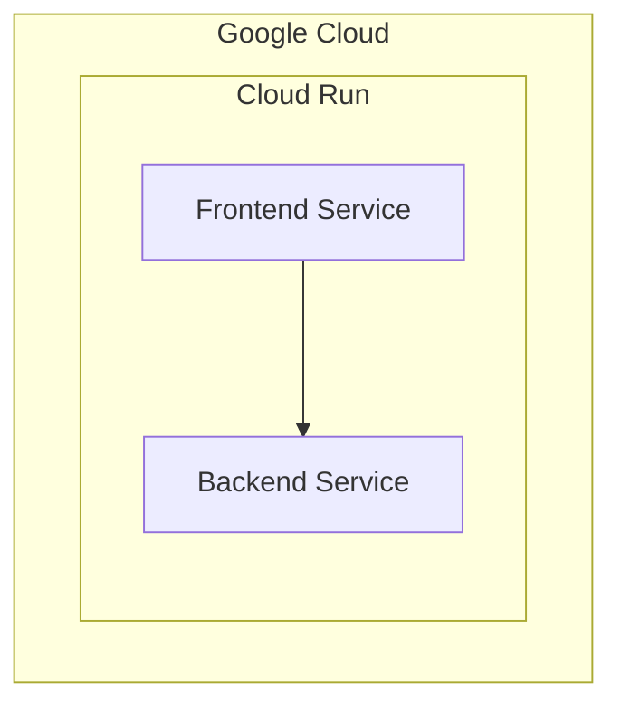

# Step 1: Core Services

```mermaid
graph TD
    subgraph "Google Cloud"
        subgraph "Cloud Run"
            A[Frontend Service]
            B[Backend Service]
        end
    end

    A --> B
```
