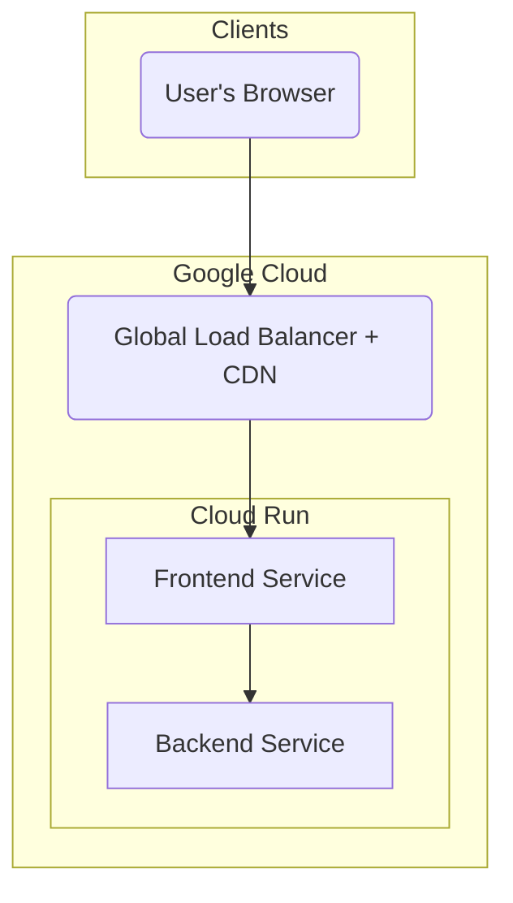

# Step 2: Load Balancer and CDN

```mermaid
graph TD
    subgraph "Clients"
        C(User's Browser)
    end

    subgraph "Google Cloud"
        LB(Global Load Balancer + CDN)

        subgraph "Cloud Run"
            A[Frontend Service]
            B[Backend Service]
        end
    end

    C --> LB
    LB --> A
    A --> B
```
