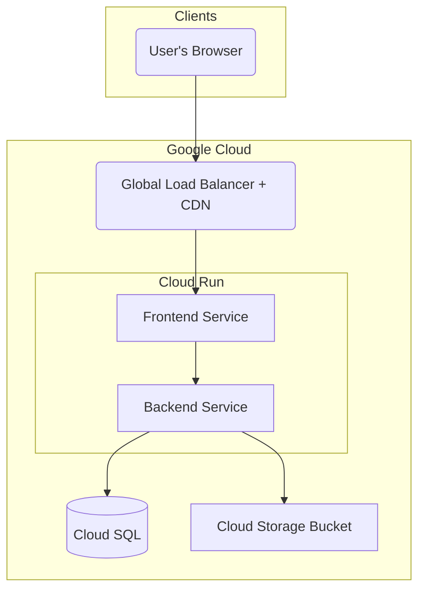

# Step 3: Database and Storage

```mermaid
graph TD
    subgraph "Clients"
        C(User's Browser)
    end

    subgraph "Google Cloud"
        LB(Global Load Balancer + CDN)
        DB[(Cloud SQL)]
        Bucket[Cloud Storage Bucket]

        subgraph "Cloud Run"
            A[Frontend Service]
            B[Backend Service]
        end
    end

    C --> LB
    LB --> A
    A --> B
    B --> DB
    B --> Bucket
```
