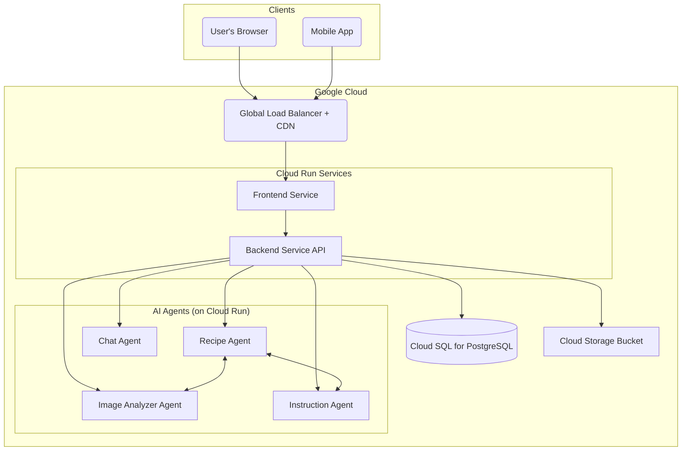

# Step 4: Full Architecture with AI Agents

```mermaid
graph TD
    subgraph "Clients"
        C(User's Browser)
        M(Mobile App)
    end

    subgraph "Google Cloud"
        LB(Global Load Balancer + CDN)
        DB[(Cloud SQL for PostgreSQL)]
        Bucket[Cloud Storage Bucket]

        subgraph "Cloud Run Services"
            A[Frontend Service]
            B[Backend Service API]
        end

        subgraph "AI Agents (on Cloud Run)"
            D[Recipe Agent]
            E[Image Analyzer Agent]
            F[Instruction Agent]
            G[Chat Agent]
        end
    end

    C --> LB
    M --> LB
    LB --> A
    A --> B

    B --> D
    B --> E
    B --> F
    B --> G
    
    D <--> E
    D <--> F

    B --> DB
    B --> Bucket
```
